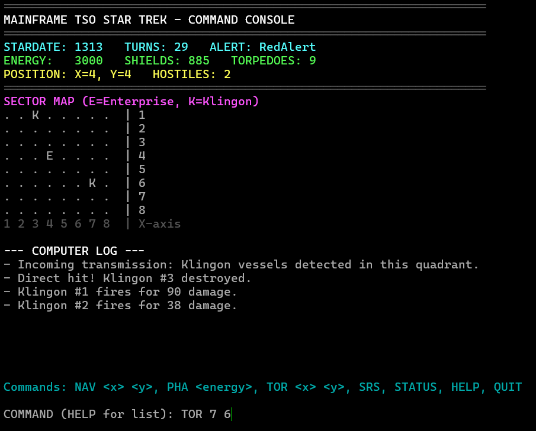
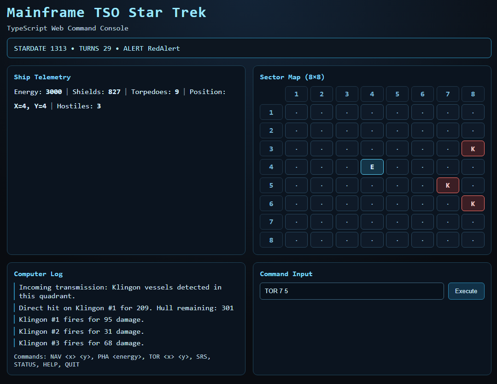

# Mainframe TSO Star Trek (PowerShell/TypeScript)

> **Note:** This entire project and its documentation were generated by AI.

A retro, command-driven Star Trek game inspired by classic TSO/ISPF gameplay, implemented with **MVC** and selected **GoF patterns**.

## PowerShell Version

PowerShell implementation of a classic Star Trek text-based game, demonstrating **MVC** architecture and various **GoF design patterns**.

## TypeScript Port

TypeScript CLI and Web versions of the same game, showcasing the same architecture and patterns in a different language and environment.
  

## Ports in separate directories

- PowerShell version (this root project)
- TypeScript CLI port: `typescript-port/`
- TypeScript Web port: `typescript-webapp/`

## Implemented patterns

- **MVC**
  - **Model**: game state, ship, enemies, rules
  - **View**: terminal status/map/log rendering
  - **Controller**: command parsing + dispatch + turn progression
- **Command**: player actions (`PHA`, `SRS`, `STATUS`, `HELP`, `QUIT`)
- **Strategy**: combat behavior (`ClassicPhaserStrategy`, `DefaultEnemyAttackStrategy`)
- **Factory Method**: scenario/game initialization (`ScenarioFactory`)
- **Observer**: views subscribe to game events
- **State**: ship condition (`Normal`, `RedAlert`, `Destroyed`)

## Run

From the project root:

- Interactive game: `powershell -ExecutionPolicy Bypass -File .\run.ps1`
- Smoke test: `powershell -ExecutionPolicy Bypass -File .\smoke-test.ps1`

## Commands

- `NAV <x> <y>`: navigate to sector coordinates
- `PHA <energy>`: fire phasers using specified energy
- `TOR <x> <y>`: fire photon torpedo at sector coordinates
- `SRS`: short-range scan
- `STATUS`: ship and mission status
- `HELP`: command help
- `QUIT`: exit game

## Notes

This scaffold focuses on clean architecture and pattern-based design. The TypeScript ports include the same command set and game flow in both CLI and browser experiences.
